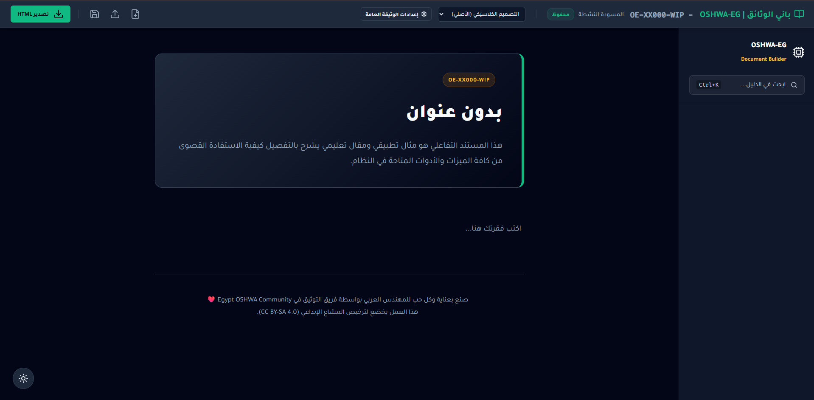
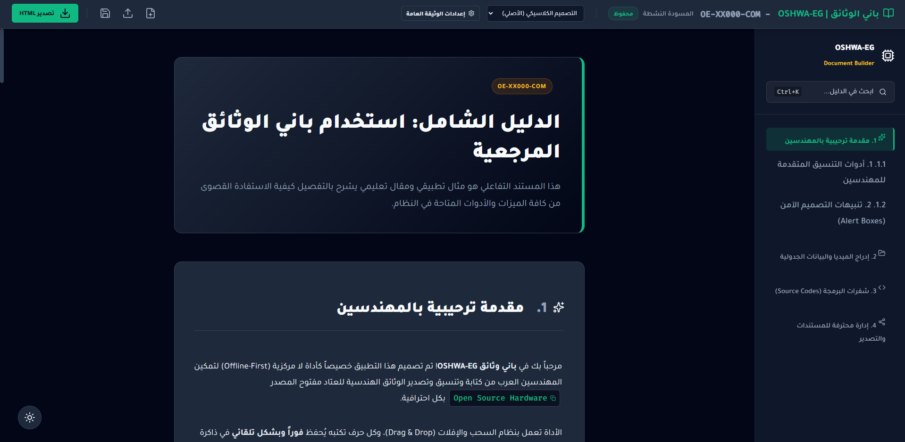
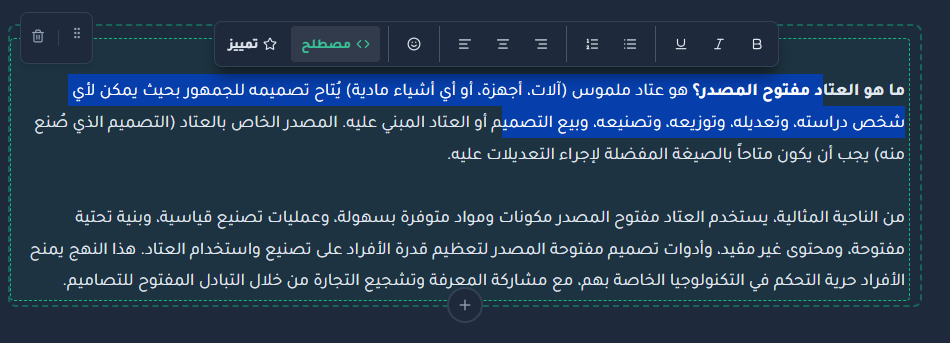
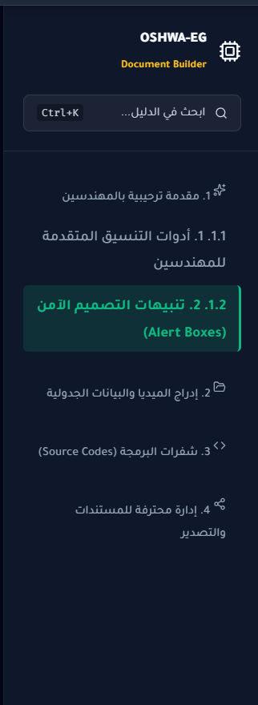
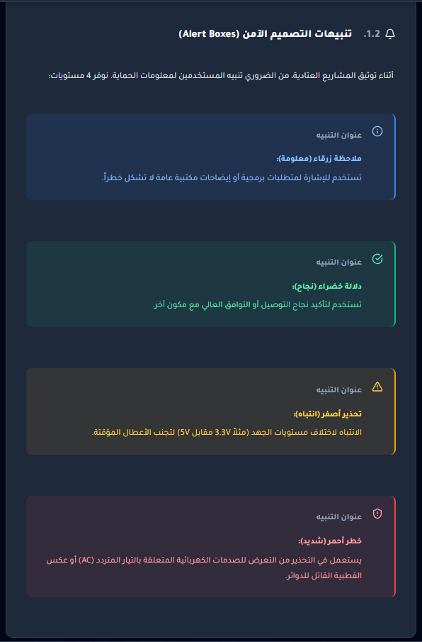
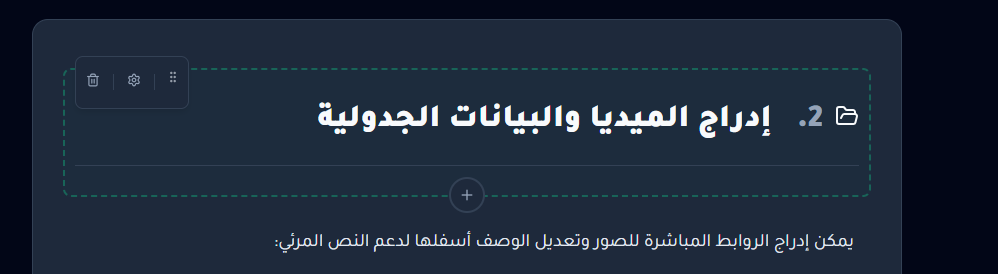
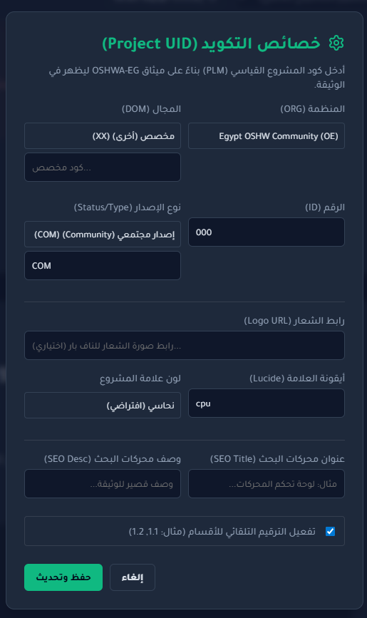
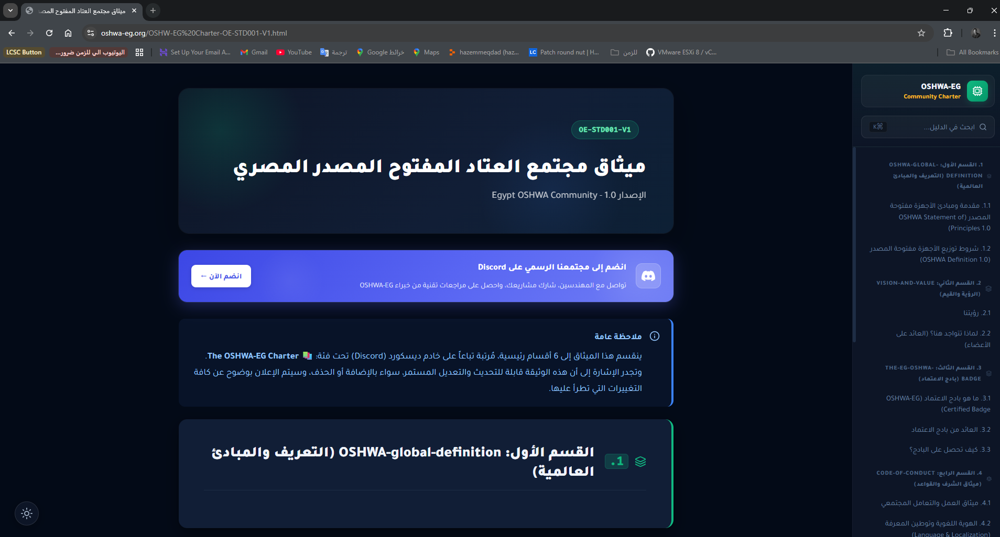

## باني الوثائق المرجعية  
### OSHWA‑EG Document Builder

> أداة عربية متقدمة لبناء أدلة ومرجعيات العتاد مفتوح المصدر، تعمل بالكامل داخل المتصفح، مع تصدير نهائي لملف HTML واحد مستقل يمكن مشاركته أو نشره مباشرة.

---

## 1. نظرة عامة على النظام

- **الهدف الأساسي:** مساعدة المهندسين العرب على كتابة وتنسيق وتصدير وثائق هندسية احترافية للـ Open Source Hardware (Datasheets, Application Notes, Project Docs) بدون أي إعدادات معقدة أو خلفية برمجية.
- **نموذج العمل:** تطبيق ويب أحادي الصفحة (Static SPA) يعمل بالكامل **داخل المتصفح** (Client‑side)، مع حفظ تلقائي في `localStorage` وتصدير HTML واحد جاهز للنشر.
- **أول تشغيل للتطبيق:**  
  - عند فتح `index.html` لأول مرة (أو عند عدم وجود مسودة محفوظة)، يتم تحميل **قالب توثيق افتراضي تعليمي** (الملف التعليمي المدمج في `default-template.js`) يعرّفك على جميع الكتل والميزات خطوة بخطوة.
  - المسودة النشطة تُخزَّن في `localStorage` تحت المفتاح: `oshw_builder_v2_data`، وتُستعاد تلقائيًا في الزيارات التالية.

**مكان مقترح لصورة توضح القالب الافتراضي عند أول تشغيل:**  

---

## 2. بنية المستند: الكتل (Blocks) ونظام الأقسام

المستند يُبنى من مجموعة كتل مرتَّبة في مصفوفة (`blocksData`). كل كتلة تمثل عنصرًا بصريًا أو معنويًا في الوثيقة (قسم، فقرة، جدول، تنبيه، صورة، كود، …).

### 2.1 أنواع الكتل المدعومة

- **أقسام وهيكل المستند**
  - `section`: قسم رئيسي (فصل) يظهر في الفهرس الجانبي مع أيقونة مخصّصة وترقيم تلقائي.
  - `sub_section`: قسم فرعي داخل القسم الرئيسي، يُرقّم تلقائيًا عند تفعيل الترقيم.
  - `h1`, `h2`, `h3`: عناوين نصية داخل الأقسام لا تغيّر هيكل الفهرس ولكن تنظّم المحتوى داخل القسم.

  **مكان مقترح لصورة توضح الفهرس الجانبي وعناوين الأقسام:**  

- **محتوى نصي**
  - `paragraph`: فقرة نصية عادية قابلة للتحرير الحر، تدعم القوائم، الروابط، والتنسيقات الأساسية.
  - `markdown`: كتلة Markdown متقدمة تُعرض بأسلوب GitHub، مع تبويب `Raw` / `Preview` وتلوين تلقائي للأكواد (Highlight.js).

- **محتوى بصري وجدولي**
  - `figure`: صورة/مخطط مع شرح (Caption) وعنوان؛ يدعم تغيير رابط الصورة من الإعدادات المصاحبة للكتلة.
  - `table`: جدول بيانات (مثالي لـ BOM أو Pinout أو جداول المقارنة)، مع أزرار لإضافة/حذف صفوف وأعمدة لحظيًا.

- **تنبيهات وسلامة**
  - `alert`: تنبيه بأربعة حالات:
    - **info:** معلومة عادية.
    - **success:** نجاح/توافق.
    - **warning:** تحذير من خطأ شائع أو اختلاف جهد.
    - **danger:** خطر حرج (تيار متردد، عكس القطبية، …).  
    يمكن التبديل بين الحالات من شريط أدوات الكتلة، ويتغير اللون والأيقونة مباشرة في المعاينة.

  **مكان مقترح لصورة توضح تنبيهات الأمان بألوانها:**  

---

## 3. واجهة التحرير التفاعلي

### 3.1 السحب والإفلات (إعادة ترتيب الكتل)

- كل كتلة ملتفة داخل حاوية (`preview-block-wrapper`) مع:
  - مقبض سحب (Grip) لنقل الكتلة لأعلى/أسفل.
  - شريط أدوات صغير خاص بكل كتلة (إعدادات، حذف، …).
  - زر دائري (+) بين الكتل لإضافة كتلة جديدة في الموضع المطلوب.
- السحب والإفلات يتم بالكامل داخل الـ iframe، مع تحديث حالة المشروع فور انتهاء الحركة، وحفظ الترتيب في `localStorage`.

**مكان مقترح لصورة تشرح السحب والإفلات بين الكتل:**  

### 3.2 شريط التنسيق العائم للنص (Floating Text Toolbar)

- عند تحديد نص داخل أي عنصر قابل للتحرير (`contenteditable`)، يظهر شريط عائم يحتوي على:
  - تنسيقات أساسية: **عريض**، *مائل*، تسطير، قوائم نقطية ورقمية، محاذاة يمين/وسط/يسار.
  - زر إدراج **مصطلح إنجليزي** يغلف النص داخل `span.eng-term` مع أيقونة نسخ.
  - زر **تمييز (Tags)** الذي يفتح قائمة وسوم ملونة (نحاسي، أخضر، أزرق، أحمر، رمادي) لتوضيح حالة المعلومة.
  - قائمة **Emoji** مع مربع بحث صغير لتضييق الأنواع المعروضة دون تكبير البلوك.
- يمكن **إزالة المصطلح أو الوسم** بسهولة عن طريق **النقر المزدوج (Double‑click)** على الوسم أو المصطلح ليعود نصًا عاديًا.
- اختصارات لوحة المفاتيح:
  - `Ctrl+Z` / `Ctrl+Y` تعمل حتى لو كان التركيز داخل الـ iframe، بفضل الجسر مع نظام الـ Undo/Redo الرئيسي.

**مكان مقترح لصورة توضح شريط التنسيق العائم فوق نص محدد:**  

---

## 4. الفهرس الجانبي (Sidebar) والتتبع التلقائي (Scroll‑Spy)

- يبني النظام تلقائيًا فهرسًا جانبيًا من جميع كتل `section` و `sub_section`:
  - الأقسام الرئيسية تظهر كرؤوس مجموعات في الشريط الجانبي.
  - الأقسام الفرعية تظهر كروابط داخلة (Indented) أسفل القسم الرئيسي.
- عند التمرير، يقوم **IntersectionObserver** بتعقّب القسم الظاهر في وسط الشاشة ويُحدّث حالة `active` على الرابط المناظر في الشريط الجانبي.
- عند الضغط على أي عنصر في الفهرس:
  - يتم التمرير السلس (`smooth scroll`) إلى القسم المطلوب.
  - يتم تلوين هذا القسم مباشرة كـ `active` حتى لو لم يكتمل التمرير بعد (تحسين تجربة الاستخدام).

**مكان مقترح لصورة توضح عمل Scroll‑Spy أثناء التمرير:**  

---

## 5. إعدادات المشروع وبيانات الـ UID و SEO

تحت زر **"إعدادات الوثيقة العامة"** يمكن ضبط مجموعة من الخصائص:

- **هوية المشروع (Project UID) وفق ميثاق OSHWA‑EG:**
  - `ORG` (المنظمة) مثل: `OE`، `OA`، أو مخصص.
  - `DOM` (المجال) مثل الأنظمة المدمجة، الروبوتات، إنترنت الأشياء، إلخ.
  - `ID` رقم المشروع.
  - `Status/Type` حالة الإصدار (WIP, REV, REL, COM, OBS) مع لون بادج مناسب.
  - يتم تجميعها في سلسلة ترميزية مثل: `OE-EM001-COM` تظهر في أعلى الوثيقة.

- **العلامة التجارية للوثيقة:**
  - `brandMain` و `brandSub` (اسم المنتج أو اللوحة، وسطر فرعي مكمّل).
  - أيقونة Lucide الخاصة بالمشروع (مثل `cpu`, `zap`, `git-merge`).
  - رابط شعار (Logo URL) يُعرض في الشريط الجانبي.

- **إعدادات SEO:**
  - عنوان SEO (`seoTitle`) ووصف (`seoDesc`) يُحقنان في `<title>` و`<meta name="description">` في ملف HTML المصدَّر.

- **الترقيم التلقائي للأقسام:**
  - خيار `autoNum` لتفعيل/إيقاف ترقيم الأقسام (1، 1.1، 1.2، …) دون التأثير على النص الأصلي للعناوين.

**مكان مقترح لصورة توضح نافذة إعدادات المشروع:**  

---

## 6. إدارة المسودات والحفظ التلقائي

- **الحفظ التلقائي:**  
  - كل تغيير على الكتل أو الإعدادات يُخزَّن تلقائيًا في `localStorage`، مع مؤشر حالة في الشريط العلوي (`محفوظ` / `جاري الحفظ…`).  
  - تتم أيضًا إدارة سجل تاريخ (History) داخلي يسمح بالتراجع/الإعادة حتى 50 خطوة.

- **تصدير المسودة (Draft Export):**
  - زر الحفظ إلى `JSON` يقوم بتصدير بنية `{ header, blocks }` بنفس الهيكل المستخدم داخليًا.
  - مناسب لمشاركة العمل مع زميل أو عمل نسخ احتياطية.

- **استيراد المسودة (Draft Import):**
  - يمكن تحميل ملف JSON سبق تصديره، ليُعاد بناء `projectMeta` و`blocksData` ثم تحديث المعاينة فورًا.

---

## 7. التصدير النهائي لملف HTML واحد

- زر **"تصدير HTML"** يولّد ملفًا واحدًا:
  - يحتوي على:
    - HTML كامل للوثيقة (رأس + فهرس + محتوى + تذييل).
    - CSS مدمج (Themes + Layout + Markdown).
    - JavaScript مدمج لميزات القراءة (Dark/Light، البحث الداخلي، Scroll‑Spy، تلوين الأكواد).
  - لا يعتمد على أي ملفات خارجية (`.css` أو `.js`) داخل نفس المسار؛ فقط مكتبات CDN العامة (الخطوط، Highlight.js، Lucide، Fuse.js، Marked).
- الملف الناتج يمكن:
  - فتحه مباشرة بلا إنترنت.
  - رفعه كما هو إلى GitHub Pages أو أي استضافة ثابتة.

**مكان مقترح لصورة توضح شكل ملف HTML النهائي في المتصفح:**  

---

## 8. بنية المشروع (ملخص تقني للمطورين)

- `index.html`  
  نقطة الدخول الوحيدة. تربط:
  - `css/main.css` لواجهة الباني.
  - `js/meta-data.js` لبيانات ORG/DOM/Status.
  - `js/themes.js` لتعريف ثيمات العرض (Builder + Charter) كسلاسل CSS مضمّنة.
  - `js/default-template.js` لتوفير القالب الافتراضي التعليمي بدون أي قيود CORS حتى على `file://`.
  - `js/app.js` لإدارة الحالة العامة (meta + blocks + history + localStorage).
  - `js/editor.js` لإنشاء الكتل وإزالتها وتحريكها.
  - `js/exporter.js` لتوليد HTML المعاينة/التصدير داخل iframe.
  - `js/bridge.js` كجسر اتصال بين iframe والتطبيق الأساسي.

- **جوانب السلامة والتصميم:**
  - لا يوجد أي اعتماد على خادم Backend؛ كل البيانات تُخزَّن في المتصفح فقط.
  - تم توحيد شكل البلوكات القديمة (من القوالب الأولى) مع النموذج الحديث عبر دالة `normalizeBlocks` لتجنّب تعارضات أو فقد سياق.
  - تم تنظيف أجزاء كود مكررة (خاصة في الجسر والـ Markdown) والتقليل من إعادة تحميل كاملة للمعاينة؛ التحديث الحي يُستخدم قدر الإمكان على مستوى الكتلة الواحدة.
  - ملفات CSS الثيمات القديمة (`css/themes/theme-builder.css` و`css/themes/theme-charter.css`) حُذفت بعد نقل كل الثيمات إلى `themes.js` لتقليل الالتباس.

---

## 9. كيفية تشغيل الأداة محليًا

### 9.1 الاستخدام العادي (مستخدم نهائي)

1. حمّل مجلد المشروع بالكامل إلى جهازك.
2. افتح الملف `index.html` في متصفح حديث (Chrome / Edge / Firefox).  
3. في أول تشغيل، سيُفتح القالب التعليمي الافتراضي تلقائيًا.  
4. ابدأ بالتعديل على الكتل أو أنشئ مستندًا جديدًا من زر "ملف جديد" في الشريط العلوي.

> ملاحظة: عند التشغيل من المسار `file://`، يتم استخدام القالب المدمج في `default-template.js` لتجنب مشكلات CORS مع ملفات JSON.

### 9.2 للمطورين

- لا حاجة لأي بيئة Node.js أو حزم NPM؛ المشروع ثابت بالكامل.
- إذا أردت تشغيله عبر خادم محلي (للاختبار مع بروتوكول `http://`):
  - يمكنك استخدام أي سيرفر استاتيكي بسيط مثل:
    - `python -m http.server`  
    - أو أي إضافة VSCode / Cursor لتشغيل static server.
- في وضع `http://`، يمكن أيضًا تحميل `default-template.json` مباشرة، مع استمرار وجود النسخة المدمجة كنسخة احتياطية.

---

## 10. الرخصة والمجتمع

- هذا المشروع جزء من مبادرات **Egypt OSHWA Community** لدعم التوثيق العربي التقني.
- النصوص والقوالب الافتراضية خاضعة لترخيص **Creative Commons BY‑SA 4.0** كما هو مذكور في تذييل المستند الافتراضي.
- يُشجَّع المهندسون على:
  - تحسين الترجمة والتعريب.
  - إضافة قوالب جاهزة لمجالات جديدة (روبوتات، IOT، أجهزة مخبرية، …).
  - اقتراح تحسينات على واجهة الباني والكتل المتاحة.
